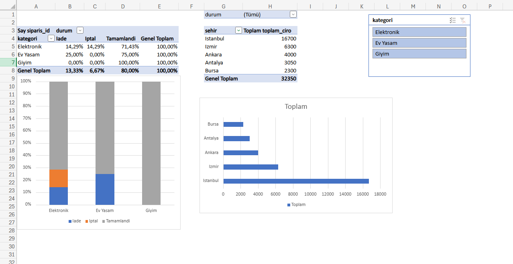

# E-Commerce Sales & Operational Analytics Dashboard

Bu proje; ilişkisel veritabanı mimarisi kurarak ham e-ticaret satış verilerini SQL ile işlemeyi, elde edilen veri modelini Excel üzerinden kârlılık, iade analizi ve bölgesel performans metriklerine dönüştürmeyi amaçlar.

---

## 📊 Dashboard Önizleme

---

## 🛠️ Kullanılan Teknolojiler
* **SQL (Relational Database Design & Aggregations):** `musteriler`, `urunler` ve `siparisler` tabloları arasında Foreign Key ilişkileri kuruldu; `INNER JOIN`, filtreleme ve kârlılık hesaplama sorguları çalıştırıldı.
* **Excel (Data Cleaning & Dynamic Dashboard):** 
  * Sayısal veri formatı dönüşümleri ve kuruş ayracı optimizasyonu yapıldı.
  * Çoklu Pivot Table mimarisi kuruldu.
  * Dilimleyici (Slicer) üzerinden PivotTable bağlantıları entegre edilerek dinamik filtreleme sağlandı.

---

## 📈 Öne Çıkan İş Çıkarımları (Business Insights)

* **Operasyonel Kayıp & İade Matrisi:**
  * **Giyim:** %0 iade ve %0 iptal oranı ile operasyonel olarak en stabil ve firesiz ürün grubu.
  * **Ev Yaşam:** Siparişlerin %25'i iade ile sonuçlanmaktadır; paketleme, teslimat veya ürün beklentisi süreçlerinin incelenmesi önerilir.
  * **Elektronik:** Siparişlerin %14,29'u iade, %14,29'u iptal olmak üzere toplam operasyonel kayıp oranı %28,58 seviyesindedir.

* **Bölgesel Satış Analizi:**
  * İncelenen dönemdeki toplam ciro **32.350 TL** olarak gerçekleşmiştir.
  * **İstanbul (16.700 TL)** tek başına toplam cironun yarısından fazlasını (%51,6) oluşturmaktadır; onu sırasıyla İzmir (6.300 TL), Ankara (4.000 TL), Antalya (3.050 TL) ve Bursa (2.300 TL) takip etmektedir.

---

## 📁 Dosya Yapısı
* `analysis_queries.sql` - Veritabanı şeması ve analitik SQL sorguları
* `dashboard_preview.png` - Yönetici paneli görsel dökümü
